**如果代码需要保密，请谨慎评估！！！**

# 工具介绍

该工具是面向三方库鸿蒙化适配的自动化工作流工具，核心用于 Flutter 插件、React Native 插件以及原生 Android 三方库向 HarmonyOS 的迁移适配。

---

# 工具使用约束

**网络与 API Key 要求**
- 使用前请确保网络能够正常访问大模型服务
- 需要购买 API Key，建议模型选择：GLM 5.0/5.1、GPT 5.5、Claude Opus 4.7

**安全提示**
- 由于需要访问大模型服务，使用前请评估代码安全风险

---

# 环境准备

## 1. 开发基础工具安装

| 工具 | 说明 |
|------|------|
| **Node.js** | 需能执行 `node`、`npm`，用于运行管理面板，要求 node >= 18，建议使用 20.x 或 22.x 版本。[下载页面](https://nodejs.org/en/download) |
| **npm** | 推荐下载 npm v11 版本。[下载说明](https://docs.npmjs.com/try-the-latest-stable-version-of-npm) |
| **JDK** | 需要安装 Java 环境，推荐下载 JDK 17 版本 |
| **Python** | 需要安装 Python 环境，推荐下载 3.13 版本 |
| **Git** | 需能执行 `git`，用于克隆/拉取插件仓库。若需从 GitHub 拉取 SDK 或相关依赖，请自行提前配置好 Git 代理 |
| **ripgrep** | 需能执行 `rg`，用于代码内容搜索。[下载页面](https://github.com/BurntSushi/ripgrep)<br/>- Mac: `brew install ripgrep`<br/>- Linux: `sudo apt install ripgrep`<br/>- Windows: `winget install BurntSushi.ripgrep.MSVC` |

## 2. Flutter 环境准备（转换 Flutter 插件时选择）

OpenHarmony 版 Flutter 环境搭建可参考：[环境搭建指导](https://gitcode.com/openharmony-tpc/flutter_samples/blob/master/ohos/docs/03_environment/OpenHarmony-flutter%E7%8E%AF%E5%A2%83%E6%90%AD%E5%BB%BA%E6%8C%87%E5%AF%BC.md)

环境中执行 `flutter doctor`，检查当前是否已有鸿蒙平台支持。

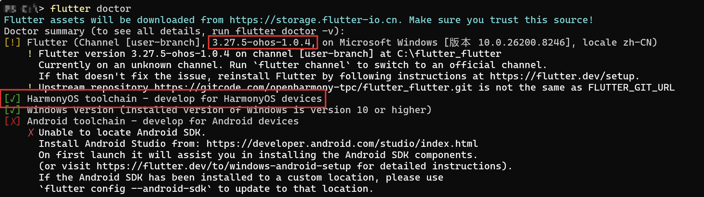

## 3. 鸿蒙工具链环境准备

下载并安装 OpenHarmony 最新 DevEco Studio 开发工具，可参考：[环境搭建指导](https://gitcode.com/openharmony-tpc/flutter_samples/blob/master/ohos/docs/03_environment/OpenHarmony-flutter%E7%8E%AF%E5%A2%83%E6%90%AD%E5%BB%BA%E6%8C%87%E5%AF%BC.md)

**工具说明：**
- **DevEco Studio**：建议安装目录不要包含空格，避免后续环境变量、脚本调用或工具链执行出现路径解析问题
- **hdc**：需能执行 `hdc` 命令，用于设备连接、安装 HAP、查看日志
- **ohpm**：Agent 执行阶段会用到，通常随 DevEco/OHOS SDK 安装

### 3.1 Mac、Linux

**1. 编辑配置文件**

打开终端，执行以下命令编辑配置文件：

```bash
vim ~/.zshrc
```

**2. 在文件中配置环境变量**

```bash
# 配置JDK 17
export JAVA_HOME=<JAVA_HOME path>/Contents/Home
export PATH=$JAVA_HOME/bin:$PATH

# 配置OpenHarmony SDK, ohpm, hvigor, node
export TOOL_HOME=/Applications/DevEco-Studio.app/Contents # mac环境
export DEVECO_SDK_HOME=$TOOL_HOME/sdk # command-line-tools/sdk
export OHOS_SDK=$TOOL_HOME/sdk/default
export PATH=$TOOL_HOME/tools/ohpm/bin:$PATH # command-line-tools/ohpm/bin
export PATH=$TOOL_HOME/tools/hvigor/bin:$PATH # command-line-tools/hvigor/bin
export PATH=$TOOL_HOME/tools/node/bin:$PATH # command-line-tools/tool/node/bin
```

**3. 保存并退出**

按 `Esc` 键进入命令模式，输入 `:wq` 后按 `Enter` 键保存并退出编辑器。

**4. 应用配置**

执行以下命令重新加载配置使其立即生效：

```bash
source ~/.zshrc
```

### 3.2 Windows

**1. 打开系统环境变量设置**

通过以下路径访问环境变量配置界面：

**此电脑**（右键）→ **属性** → **高级系统设置** → **高级** 选项卡 → **环境变量**

**2. 配置环境变量**

配置 `OpenHarmony SDK`、`OHOS_SDK`、`ohpm`、`hvigor`、`node`

| 变量 | 值 | 作用域 |
|------|------|--------|
| `TOOL_HOME` | `<Deveco-studio Path>` | 系统变量 |
| `DEVECO_SDK_HOME` | `%TOOL_HOME%\sdk` | 系统变量 |
| `OHOS_SDK` | `%TOOL_HOME%\sdk\default` | 系统变量 |
| `Path` | `%TOOL_HOME%\tools\ohpm\bin` | 系统变量 |
| `Path` | `%TOOL_HOME%\tools\hvigor\bin` | 系统变量 |
| `Path` | `%TOOL_HOME%\tools\node\bin` | 系统变量 |

## 4. AI 编程工具配置（二选一）

- **OpenCode**：需能执行 `opencode` 命令。[下载页面](https://opencode.ai/zh/download)

  建议使用 `npm i -g opencode-ai` 安装，安装目录可以通过 `npm config get prefix` 获取，然后对应的安装目录配置到系统环境变量 PATH 中。

  > 注：如果安装时卡住，通过以下命令切换镜像源：
  > ```bash
  > npm config set registry https://registry.npmmirror.com
  > ```

- **Claude Code**（可选）：若使用 Claude Code 后端，需能执行 `claude` 命令

**Windows 平台配置**

Windows 平台如需正常执行 `opencode`，请先在 PowerShell 中允许执行本地脚本：

```powershell
Set-ExecutionPolicy RemoteSigned -Scope CurrentUser
```

**目录权限配置**

如果 Agent 需要读取工作目录，请在 `agent-android-sdk\opencode.json` 中加入目录权限配置，其中 `flutter-library-workflow路径` 替换为你的实际工程路径：

```json
"permission": {
  "external_directory": {
    "flutter-library-workflow路径/**": "allow"
  }
}
```

## 5. AI 大模型 API Key 配置

在 `adapt-workflow/data/model-tiers.json` 中指定模型。

- **配置模型**：在 `.config\opencode\opencode.json` 中（具体以 opencode 实际配置文件路径为准），配置 opencode 使用的模型及 apiKey
- **指定模型**：`adapt-workflow\data\model-tiers.json`，修改 opencode 字段，按照 `provider\model` 格式

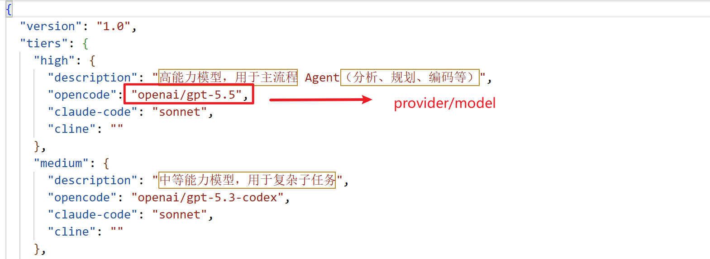

## 6. 签名替换（非必选）

如需运行到真机，需连接手机，并在 `example/ohos` 工程与 **DevEco/本机** 的签名配置中统一 **bundleName** 与证书（`~/.ohos/config` 的 `.p7b` 等），与 `primary-04` Prompt 中步骤一致。

签名文件获取参考：[华为开发者文档](https://developer.huawei.com/consumer/cn/doc/harmonyos-guides/ide-publish-app#section793484619307)

## 7. Skills 合并

`https://github.com/HarmonyOS-AI/Harmony-Skills` 目录下的**所有的 skill** 可放到工程的 `.claude/skills` 或 `~/.claude/skills` 目录下，用于扩展 Agent 能力。

---

# 工具使用

## 1. 安装依赖

在 `adapt-workflow/` 目录执行 `npm install` 安装依赖

## 2. 启动

在 `adapt-workflow/` 目录执行 `npm start` 启动管理面板，默认访问 http://localhost:3000

## 3. 使用

### 3.1 Flutter 插件鸿蒙适配操作示意

1. **选择 Flutter -> 转鸿蒙**

   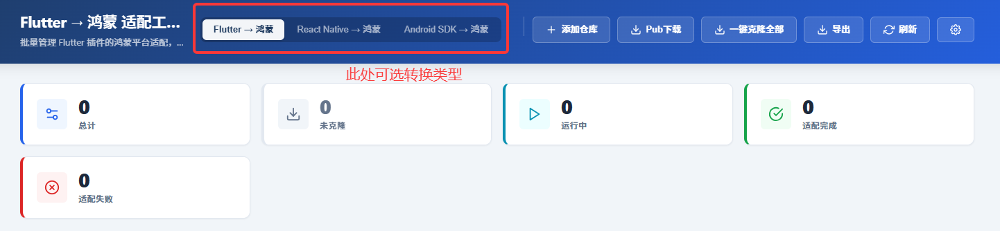

2. **添加插件代码包**
   
   可以选择从 Pub.dev 中下载 Flutter 插件，也可以从 GitHub 上下载

   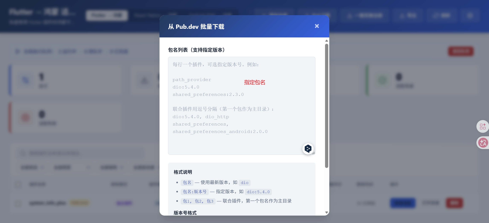

3. **任务执行**
   
   选择对应的插件，进行任务执行

   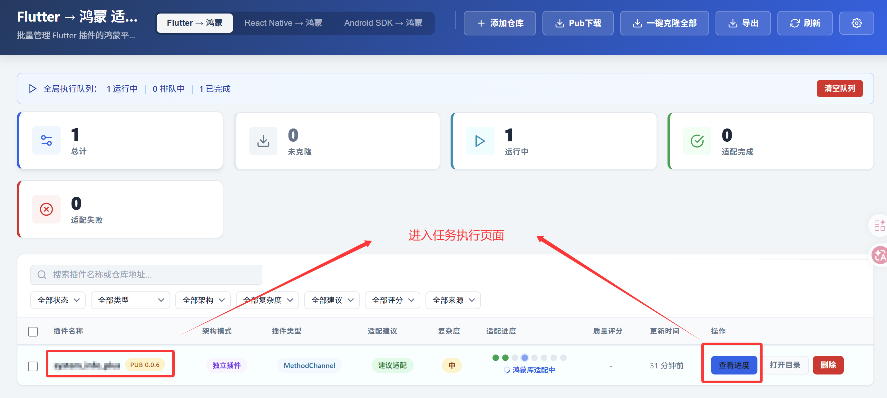

4. **查看任务执行进展**

   

5. **生成的代码工程示例**

   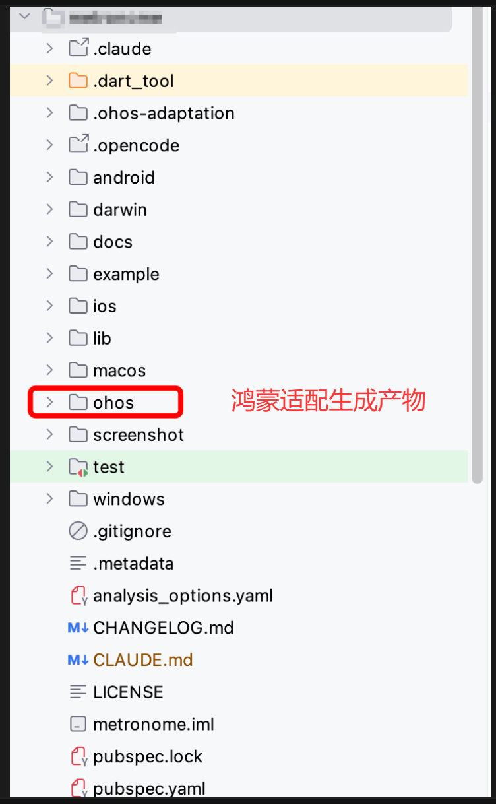

### 3.2 原生三方库鸿蒙适配操作示意

1. **选择 Android SDK -> 转鸿蒙**


2. **添加原生三方库包**
   可以选择本地上传代码包，也可以从 GitHub 上下载


3. **任务执行并查看进展**

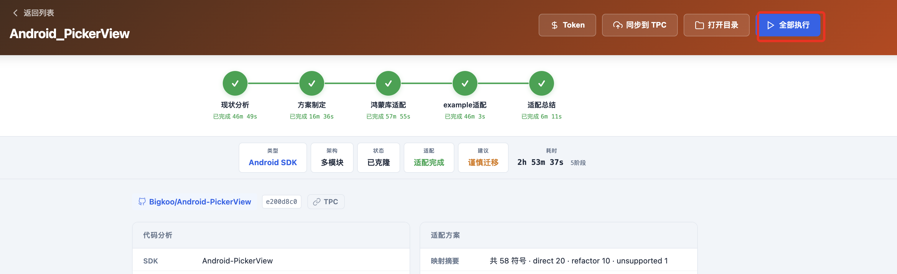

4. **生成的代码工程示例**

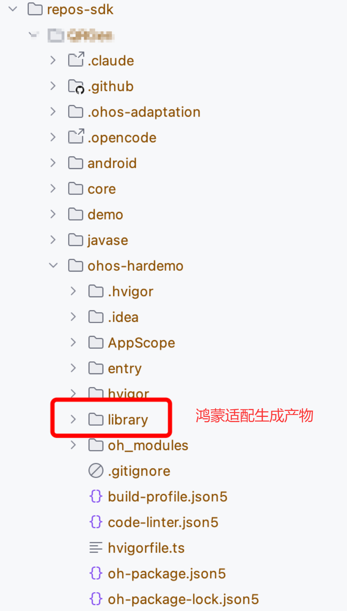

### 3.3 React Native 插件鸿蒙适配操作示意

1. **选择 React Native -> 转鸿蒙**
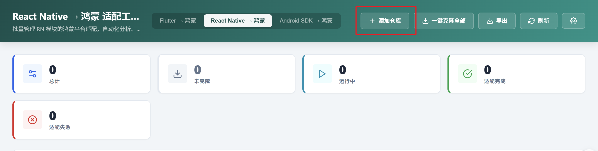

2. **添加RN插件包**


3. **任务执行并查看进展**
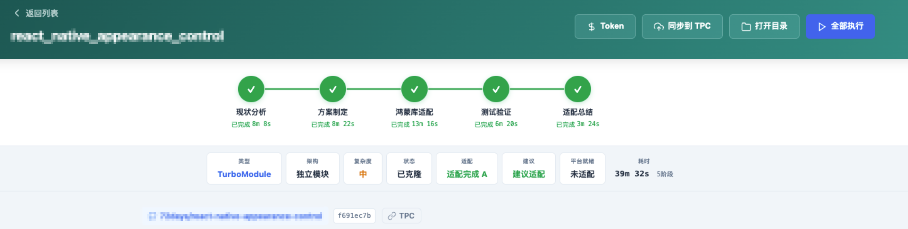

4. **生成的代码工程示例：**

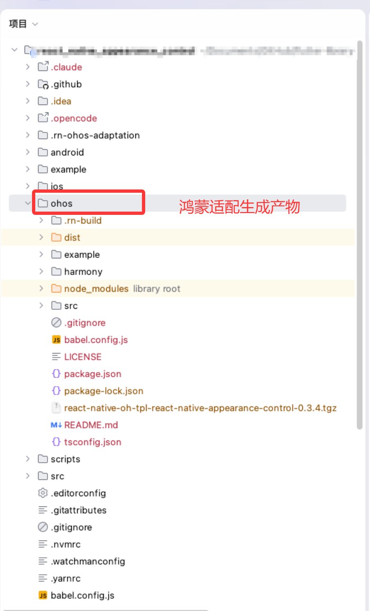
